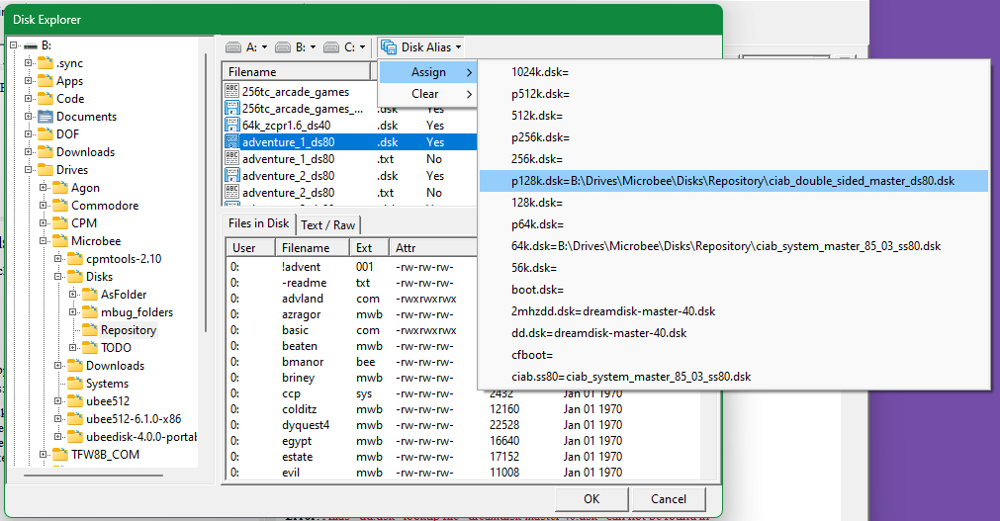

# UBEE512 Launcher

## Why?
+ **ubee512** is an excellent [Microbee](https://www.microbee-mspp.org.au/wiki/tiki-index.php?page=Microbee) emulator, covering all models and a wide range of peripherals
  + It has a myriad of options available through the settings files and command line parameters (described in its [readme](https://github.com/snakebyte69/uBee512/blob/main/doc/README))
  + Due to copyright issues, it doesn't ship with all the required files (ROMS/disks - covered in its readme)
+ **ubee512launcher** checks the files in the **uBee512** installation against the selected options in **ubee512launcher**, and highlights missing files (required files raised as error, optional as warning)
+ **ubee512Launcher** allows inexperienced users (me) to easily view, configure and select the available emulated systems
+ And yes, it's also for users (again, me) who are more comfortable with UI than command line

## Release v0.4beta
+ Fourth beta release, still lots to do yet (no actual substance to the app yet)
+ Now using Github [releases](https://github.com/mikecornflake/uBee512Launcher/releases/tag/0.4), not a Bin subfolder in the Code repository
+ To use **ubee512launcher**:
  + If **ubee512** is on your environment path, simply download relevant **ubee512launcher** binary, unzip and run
  + if **ubee512** isn't on your environment path, either:
    + run **ubee512Launcher**, open "File" - "Settings", and configure the loctions for "ubee512 executable" and "ubee512 rc (setting file)"
    + or drop the binary in the same folder as the **ubee512** binary, and run from there
  + Then:
    + Use the "Type", "Model" and "Title" dropdowns, select the emulated Microbee you wish to run
	  + Alternatively, use the Definition Explorer (Bee icon) to select preferred model 
    + Use the Disk Explorer to find some dsk files.  Select a bootable DSK, and click "Add DSK to A"
    + Click "Launch"
+ "System Macros" renamed to "System Definitions" (or more simply "Definitions" in places) to be more consistent with **uBee512** README
+ Re-worked Disk Format selection - I hadn't realised **uBee512** was so good at detecting Disk Format, so by default I now let **uBee512** do the work.  User can still override...
+ About box added - dynamically loads uBee512 License and Readme, so requires the folder being set up in Settings to work
+ Settings and Debug now saved in local user config directory (%LOCALAPPDATA%\uBee512Launcher or ~/.config/uBee512Launcher) - resolves issues on macOS
  
### Whats new (Trunk)
+ Next release will be a big one:
  + Framework for core functionality now in, and checks/options for Disk based models mostly complete
  + Virtually nothing for ROM based models implemented (and won't until 0.6beta release)
    + Framework shouldn't need much tweaking to accomodate (famous last words)
  + Sigh, actual functionality implies bugs.  Keep your eyes open, and please report...
+ Framework for Validators added (See section on Validation Rules below)
  + Disk Alias Validator added (finished)
  + Installation Validator added (charrom.bin/rom1.bin checks.  Settings & Alias file checks.  Not sure what else to check, but this got me thinking about adding Installation Aids)
  + Definition Validator refined (Decent checks on SRAM, Disks, Tapes.  NOTHING on ROMs, PAKs, HDDs or IDEs)
  + Microbee Model Validator added (Only checks default boot disks for Disk Models.  No checks for boot ROMs for IC models)
+ Added "Disk Alias" dialog (Add/Delete Alias, Edit Alias name.  Assign disk/clear assignment for Alias.  Display validator checks)
+ Integrate "disks.alias" updates into Disk Explorer (Assign disk to existing Alias, Clear existing Alias)
+ Add Display options (monitor, opengl/sdl)
+ UI has again been reworked several times.
  + Changed Disk A/B/C selection in main form:
    + Can use dialog to select a file/folder from the filesystem
    + or choose a valid disk alias from the dropdown
  + Issues found by Validators now being displayed in assorted locations across UI
  + Now displaying Issues using HTML

## Notes on implementation
+ Only allows bootable DSKs to be loaded in A: (only checks DSKs for bootability)
+ Has a "File Preview": for now, either shows contents of text files, or files inside a DSK (you need to load the patched **CPMTools** using "File" - "Settings" for the DSK listing to work)
+ Contents of DSK listed using either original **CPMtools** or patched **CPMTools** (allows for Microbee specific formats)
+ Parses ubee512rc to build up System Definitions, uses these in Main Form & Definitions Explorer
+ I know there looks like a lot of Definitions in ubee512rc sample.  Err, I'm currently filtering out about half - the ones I haven't researched
+ Signficant testing under macOS/Cocoa.  Bugger - Cocoa framework not fully implemented in LCL, so some workarounds for known issues with TComboBox and TListView
+ Minor testing under Ubuntu/GTK2.  Same lack of full feature for TListView as Cocoa, so workaround there also worked here
+ Most dev work & testing done on Windows 11

## Implemented Validation Rules
+ Results of Validation checks visible several locations around the UI (still to add "Issues" dialog)
+ **ubee512** Installation checks
  + Does charrom.bin & rom1.bin exist?  (Error flag if not)
  + Does "ubee512rc" exist? (Error flag if not)
  + Does "disks.alias" and "roms.alias" exist? (Warning flag if not)
+ Microbee Model checks
  + For each Disk Model:
    + Does a boot disk exist? (model.dsk, or boot.dsk) (Warning flag if not)
    + Does a boot disk alias exist? (Warning flag if alias exists, but not defined)
    + Is Boot Disk readonly? (Error flag is so)
+ "disk.alias" checks:
  + Does the alias have a lookup filename? (warning flag if not)
  + Does the lookup filename exist? (error flag if not)
+ uBee512rc Definition checks:
  + For disks assigned to A, B or C:
    + If absolute filename, does disk exist?  (Error flag if not)
	+ If relative filename:
	  + does disk exist in ubee512 working directory "disks" subfolder? (no flag if it does)
	  + If not: Does entry exist in "disks.alias"? (info flag if it does)
	    + Is "disks.alias" entry valid? (checks both absolute and relative file paths). (Flag escalated to Error if not)
  + For --sram-file, --ide-a0, --tapei, --tapeo entries: Does file exist? (checks absolute filenames or looks in correct subfolder if relative) (Error Flag if not) 	
+ You may notice from the above that some checks are duplicated:
  + This is by design to assist end user diagnosis
  + Sigh. Likely to be the most common source of bugs as a consequence

# TODO

## Short term (planned for 0.5beta)
+ Implement --account (if rc file not in expected location)
+ Add TMainFormValidator (ie, error if you've selected a Disk model, but no disks; warning if you have different format disks in each drive...)
+ Add Installation Aids (copy \*.sample files to appropriate locations.  HTML summary of Repository Locations/ettiquette.  Display Validator results)
+ Add "Issues" pane to summarise ALL issues
+ Add GPL licenses to uBee512Launcher, LGPL to IM_units.lpk

## Medium term (not until 0.6beta or higher)
+ Add awareness of **RunCPM** folder structure
+ Add awareness of roms.alias + native md5 (before doing the below)
+ Add boot ROM checks to TModelValidator
+ Add support for PAKx (inc Validator)
+ Add support for HDDx (inc Validator)
+ Add support for IDEx (inc Validator)
+ Add support for non libdsk file formats (this might not be a goal anymore - I hadn't realised ubee512 was so good at detecting disk format)
+ Continue to add support for working with DSK files prior to running in a CP/M system
  + Create blank DSK
  + DSK To/From folder (inc To/From **RunCPM** folder)
+ Add direct support for the zip file structure pioneered by **@ChickenMan** for both **MSPP** repository and **Microbee Technology** repository
  + Display embedded ReadMe in the Preview Pane
  + Implement a "Mount ZIP" that extracts the DSK, then actually mounts that DSK in the CP/M system
+ Add support for Microbee Peripherals (Beetalker etc)
+ Add support for **UBEEDISK** tools (to be honest, this means learning them first)
+ I keep thinking about adding ability for users to define their own System Definitions (by first copying an existing).
+ (Library): Write a CommandLine+Params_As_String to CommandLine+Array_of_Param
+ Expand roms.alias to a full UI - offering ability to QC/add/edit/delete entries

## Long Term 
(_dreamer! you're nothing but a dreamer_)
+ Investigate automating a running instance of **UBEE512** (allow dynamic changing of disks)

# Development Notes
+ Developed under Windows 11, Ubuntu & macOS using Lazarus Trunk (3.99) / fpc 3.2.2 / 64bit
+ Due to changes in TurboPowerHTML rendering only use Lazarus Trunk for compiling releases
+ Uses a OO framework I developed while freelancing as "Inspector Mike" 
  + There's some code tidy-up pending, this framework was developed during Lazarus & fpc early days (2009 to 2014)
  + Both projects have since moved on, leaving me with some now redundant routines

## Distribution
+ **UBEE512**, **UBEEDISK**, patched **CPMTools**, original **CPMTools** & **RunCPM** are NOT distributed with this application.  You'll have to download these separetely (see Acknowledgements)
+ The app will look for these on your environment path.  If they're not on the path, you'll need to open "File" - "Settings" and set the appropriate paths manually

## Screenshots

### Build Notes
+ This project requires the IM_units.lpk (Lazarus Package) from https://github.com/mikecornflake/InspectorMike-common
  + Clone InspectorMike-common
  + Install LazSerial (either use Lazarus Online Package Manager, or clone https://github.com/JurassicPork/TLazSerial)
    + not needed for uBee512Launcher, but is needed for IM_units.lpk)
  + In Lazarus: "Project" "Open"
    + Select "uBee512Launcher.lpr"
  + Then "Package" "Open Package File (.lpk)"
    + Select "InspectorMike-common\Packages\IM_units.lpk"
    + click on "Compile",
    + Then "Use" - "Add to Project" (or "Use" - "Install")
  + You should now be able to compile "uBeeLauncher.lpr"

# Acknowledgements
+ **Microbee Technologies** (http://www.microbeetechnology.com.au/) is the copyright holder for the Microbee systems
  + I strongly recommend their [keyboard replacement kits](http://www.microbeetechnology.com.au/keyboardreplacementkits.htm) which resolves long standing issues with the aging originals (neither a paid endorsement, nor anything to do with emulators or their launchers)
+ Many thanks to all users who created tools, disk/ROM images and documentation:
  + User **@uBee** on the **MSPP** forum (https://www.microbee-mspp.org.au/forum/) is to be congratulated.  **@uBee** has developed a very flexible Microbee emulator that is able to emulate all Microbee flavours and is configurable via the rc file and the command line
  + User **@Chickenman** on the **Microbee Technology** forum  (https://microbeetechnology.com.au/forum/) also deserves praise. **@Chickenman** is a dedicated and active Archivist, current curator of the **Microbee Technology** repository and past curator of the **MSPP** repository. **@Chickenman** is also active across several other projects, including https://archive.org/details/@chickenman
+ **UBEE512**, **UBEEDISK** & patch for **CPMTools** developed by user **@uBee**
+ **UBEE512**, **UBEEDISK** & patched **CPMtools** (2.1) can be obtained from the MSPP repository: https://www.microbee-mspp.org.au/repository/
+ Original **CPMTools** (2.23) can be obtained from: http://www.moria.de/~michael/cpmtools/.  This doesn't support most Microbee disk formats
+ Where the above tools access DSK files, they do so using **libdsk** either directly (**CPMTools**) or optionally (**UBEE512**) : https://www.seasip.info/Unix/LibDsk/
+ **UBEE512** has been forked (there was limited support for MacOS), and ongoing development & friendly support is happening in this discord: https://discord.gg/2rBya9Hh
+ **RunCPM** can be obtained from: https://github.com/MockbaTheBorg/RunCPM
+ Prebuilt **Lazarus/fpc** can be obtained from: https://sourceforge.net/projects/lazarus/files/
+ But really - you know you want to compile **Lazarus** trunk: https://gitlab.com/freepascal.org/lazarus/lazarus
+ And finally - a massive shout out to everyone on the Lazarus forums and mailing lists.  Very helpful and knowledgable, the lot of them: https://forum.lazarus.freepascal.org/index.php

# Licenses
+ ubee512launcher binaries and source code are released under [GPL 3.0](https://www.gnu.org/licenses/gpl-3.0.en.html)
+ ubee512launcher uses:
  + Libraries and code supplied by the freepascal project (FCL, RTL) & the Lazarus project (LCL) under a [modified Library GPL with linking exceptions](https://wiki.freepascal.org/FPC_modified_LGPL)
  + IM_units package which is released under [GPL 3.0](https://www.gnu.org/licenses/gpl-3.0.en.html)
  + IM_units package contains third party packages released under seperate licenses.  Most third party packages are not used by ubee512launcher, the exception is:
    + TurbopowerIPro (distributed with Lazarus and used for HTML rendering) - this is released under MPL 1.1 ([Mozilla Public License Version 1.1](https://www.mozilla.org/en-US/MPL/1.1/))

Mike Thompson
mike.cornflake@gmail.com
+ Project start 2 Jan 2024
+ Updated 7 Feb 2024
