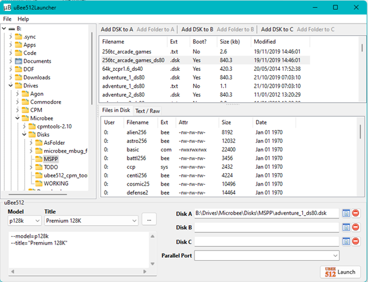
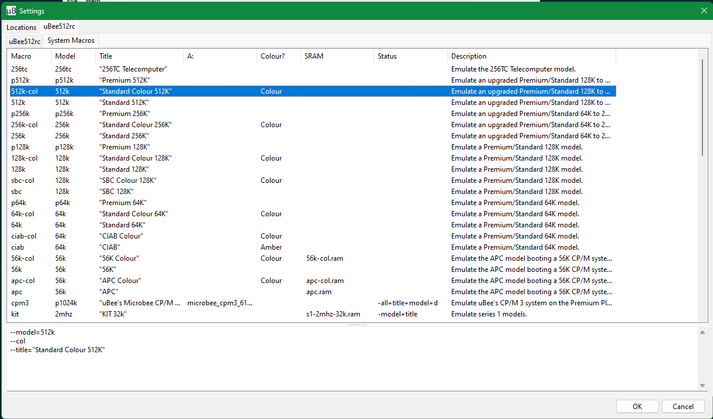

# UBEE512 Launcher

## Why?
+ ubee512 is an excellent emulator, with a myriad of options available through the setting file (rc) and command line parameters.  But you have to be familiar with these.
+ ubee512Launcher instead allows inexperienced users (me) to easily view & select the available emulated systems defined in the setting file (and there's a lot of them)
+ Yeah, it's also for users (again, me) who are more comfortable with UI than command line.

## Release v0.4beta
+ Fourth beta release, still lots to do yet
+ [Link to precompiled binaries](bin)
+ To use:
  + If ubee512 is on your environment path, simply download relevant binary and run.
  + if ubee512 isn't on your environment path, either
    + run ubee512Launcher, open "File" - "Settings", and configure the loctions for "ubee512 executable" and "ubee512 rc (setting file)"
    + or drop the binary in the same folder as the ubee512 binary, and run from there
  + Then:
    + Use the "Type", "Model" and "Title" dropdowns, select the emulated Microbee you wish to run
	  + Alternatively, use the Definition Explorer (Bee icon) to select preferred model 
    + Use the Disk Explorer to find some dsk files.  Select a bootable DSK, and click "Add DSK to A"
    + Click "Launch"

### Whats new
+ "System Macros" renamed to "System Definitions" to be more consistent with uBee512 README.
+ Re-worked Disk Format selection - I hadn't realised uBee512 was so good at detecting Disk Format, so by default I now let uBee512 do the work.  User can still override...
+ Framework for Validators added.  Decent checks on SRAM, Disks, Tapes.  NOTHING on ROMs, PAKs, HDDs or IDEs.
+ UI has been reworked several times.
  + Disk Explorer is now it's own form (not needed for ROM Bees, so why waste space)
  + System Definitions now highlights which Definitions with known issues (as determined by the validators).  In addition to highlighting failed rows as red, needed to add red/green icons to workaround LCL shortcomings on macOS and Linux
  + About box added - dynamically loads uBee512 License and Readme, so requires the folder being set up in Settings to work
  + Closing in on decent selection of icons.
  + added teasers for "disks.alias" and "roms.alias".  Mainly to nag me into implementing these next
 + Settings and Debug now saved in local user config directory (%LOCALAPPDATA%\uBee512Launcher or ~/.config/uBee512Launcher) - resolves issues on macOS
 + Signficant testing under macOS/Cocoa.  Bugger - Cocoa framework not fully implemented in LCL, so some workarounds for known issues with TComboBox and TListView
 + Minor testing under Ubuntu/GTK2.  Same lack of full feature for TListView as Cocoa, so workaround there also worked here.
 + Most dev work & testing done on Windows 11. 

## Notes on implementation
+ Only allows bootable DSKs to be loaded in A: (only checks DSKs for bootability)
+ Has a "File Preview": for now, either shows contents of text files, or files inside a DSK (you need to load the patched **CPMTools** using "File" - "Settings" for the DSK listing to work)
+ Contents of DSK listed using either original **CPMtools** or patched **CPMTools** (allows for Microbee specific formats)
+ Parses ubee512rc to build up System Definitions, uses these in Main Form & Definitions Explorer
+ I know there looks like a lot of Definitions in ubee512rc sample.  Err, I'm currently filtering out about half - the ones I haven't researched

# TODO

## Short term (planned for 0.5beta)
+ Add Display options (position relative to launcher, monitor, opengl/sdl)
+ Add awareness of disks.alias and roms.alias (validator checks bth for the .alias files themselves, and use the alias when checking system definitions).
+ Expand Validator to PAKx/ROMx
+ Add support for HDDx
+ Add support for IDEx
+ Prevent selection of invalid Definitions in main form (hide entirely?), or at least raise awareness
  + One "Issues" pane to rule them all?
+ Add awareness of **RunCPM** folder structure

## Medium term (not until 0.6beta or higher)
+ Add support for non libdsk file formats (this might not be a goal anymore - I hadn't realised ubee512 was so good at detecting disk format)
+ Continue to add support for working with DSK files prior to running in a CP/M system
  + Create blank DSK
  + DSK To/From folder (inc To/From **RunCPM** folder)
+ Add direct support for the zip file structure utilised by **@ChickenMan** on both MSPP forum and MicrobeeTechnology forum
  + Display embedded ReadMe in the Preview Pane
  + Implement a "Mount ZIP" that extracts the DSK, then actually mounts that DSK in the CP/M system
+ Add support for Microbee Peripherals (Beetalker etc)
+ Add support for **UBEEDISK** tools (to be honest, this means learning them first)
+ I keep thinking about adding ability for users to define their own System Definitions (by first copying an existing).
+ (Library): Write a CommandLine+Params_As_String to CommandLine+Array_of_Param
+ Expand disks.alias and roms.alias to a full UI for each - offering ability to QC/add/edit/delete entries

## Long Term 
(_dreamer! you're nothing but a dreamer_)
+ Investigate automating a running instance of **UBEE512** (allow dynamic changing of disks)

# Development Notes
+ Developed under windows using Lazarus 2.2.6 / fpc 3.2.2 / 64bit
+ Tested under Ubuntu & macOS using Lazarus 3.0 / fpc 3.2.2 / 64bit
+ Uses a OO framework I developed while freelancing under "Inspector Mike".  
  + There's some code tidy-up pending, this framework was developed during Lazarus & fpc early days (2009 to 2014).
  + Both projects have since moved on, leaving me with some now redundant routines.

## Distribution
+ **UBEE512**, **UBEEDISK**, patched **CPMTools**, original **CPMTools** & **RunCPM** are NOT distributed with this application.  You'll have to download these separetely (see Acknowledgements)
+ The app will look for these on your environment path.  If they're not on the path, you'll need to open "File" - "Settings" and set the appropriate paths manually.

## Screenshots

### Build Notes
+ This project requires the IM_units.lpk (Lazarus Package) from https://github.com/mikecornflake/InspectorMike-common
  + Clone the entire project
  + Install LazSerial (either use Lazarus Online Package Manager, or clone https://github.com/JurassicPork/TLazSerial)
  + In Lazarus: "Project" "Open"
    + Select "uBee512Launcher.lpr"
  + Then "Package" "Open Package File (.lpk)"
    + Select "InspectorMike-common\Packages\IM_units.lpk"
    + click on "Compile",
    + Then "Use" - "Add to Project" (or "Use" - "Install")
  + You should now be able to compile "uBeeLauncher.lpr"
  
# Acknowledgements
+ User **uBee** on the MSPP forum (https://www.microbee-mspp.org.au/forum/) is to be congratulated.  **uBee** has developed a very flexible Microbee emulator that is able to emulate all Microbee flavours and is configurable via the rc file and the command line. 
+ **UBEE512**, **UBEEDISK** & patch for **CPMTools** developed by user **@uBee**.
+ **UBEE512**, **UBEEDISK** & patched **CPMtools** (2.1) can be obtained from the MSPP repository: https://www.microbee-mspp.org.au/repository/
+ Original **CPMTools** (2.23) can be obtained from: http://www.moria.de/~michael/cpmtools/.  This doesn't support most Microbee disk formats.
+ Where the above tools access DSK files, they do so using **libdsk** either directly (**CPMTools**) or optionally (**UBEE512**) : https://www.seasip.info/Unix/LibDsk/.  
+ **UBEE512** has been forked (there was limited support for MacOS), and ongoing development & friendly support is happening in this discord: https://discord.gg/2rBya9Hh
+ **RunCPM** can be obtained from: https://github.com/MockbaTheBorg/RunCPM
+ Prebuilt **Lazarus/fpc** can be obtained from: https://sourceforge.net/projects/lazarus/files/
+ But really - you know you want to compile **Lazarus** trunk: https://github.com/User4martin/lazarus
+ And finally - a massive shout out to everyone on the Lazarus forums and mailing lists.  Very helpful and knowledgable, the lot of them: https://forum.lazarus.freepascal.org/index.php

# License
This is intended to be free code available to everyone for use everywhere.  Frankly, this is a simple UI wrapping the more complicated emulators and CPMTools developed and released by others.  However, I'm aware there are issues with releasing code under that sort of vagueness, so I've got to have a quick look around for an appropriate open source license.  Haven't done that yet...

Mike Thompson
mike.cornflake@gmail.com
Project start 2 Jan 2024
Updated 22 Jan 2024
